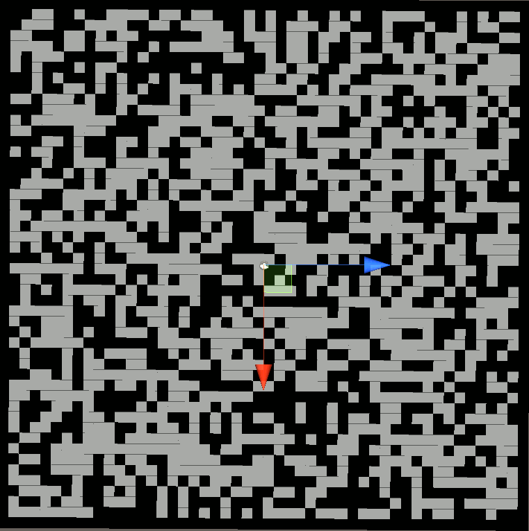

I started working on a Unity Tutorial for [Procedural Cave Generation](https://unity3d.com/learn/tutorials/projects/procedural-cave-generation-tutorial/cellular-automata), and it's really cool, but I have a few thoughts on how to refactor and clean up the code.

The pseudo-code logic for the algorithm is as follows:

```
for x in rows:
  for y in cols:
     if is_edge(x,y):
       map[x,y] = 1
     else:
       map[x,y] = 1 if random() > probability else 0

for i in smoothing_run_count:
  for x in rows:
    for y in cols:
      num_walls = CountWalls(x, y)
      if num_walls > 4:
        map[x,y] = 1
      else if num_walls < 4:
        map[x,y] = 0
        
for x in rows:
  for y in cols:
    color = black if map[x,y] else white
    DrawCube(ScreenPosition(x, y), color)
```

As you can see from my pseudo-code, I come from a mostly python background. One rule that I tend to use in python is that if I have a function that consists of a for loop, I extract the body of the loop into a function, and use built-in language features to handle the iteration. Many modern languages, C# included, have higher-level constructs for iteration. In this case, I chose to use [delegates](https://docs.microsoft.com/en-us/dotnet/csharp/programming-guide/delegates/using-delegates) and the [visitor pattern](https://en.wikipedia.org/wiki/Visitor_pattern)

Because we have two types of actions we may want to perform, those that update the map and those that don't, we need two different delegates, and associated visitors:

```csharp
private delegate void SpaceVisitor(int x, int y);

void ForEachSpace(SpaceVisitor visitor) {
    if (map == null) {
        return;
    }
    for (int x = 0; x < width; x++) {
        for (int y = 0; y < height; y++) {
            visitor(x, y);
        }
    }
}

private delegate int SpaceUpdater(int x, int y);

void UpdateSpaces(SpaceUpdater updater) {
    for (int x = 0; x < width; x++) {
        for (int y = 0; y < height; y++) {
            map[x, y] = updater(x, y);
        }
    }
} 
```

Now, we can modify the helper functions so that instead of being simple [subroutines](https://en.wikipedia.org/wiki/Subroutine), we are actually writing functions that map single inputs to behaviors.

I initially had these as individually named methods:

```csharp

int InitialValue(int x, int y) {
    if (IsEdge(x, y)) {
        return 1;
    } else {
        return rand.Next(0, 100) <= percentFilled ? 1 : 0;
    }
}

int Smooth(int x, int y) {
    int wallCount = NeighborWallCount(x, y);
    if (wallCount > 4) {
        return 1;
    } else if (wallCount < 4) {
        return 0;
    }
    return map[x, y];
}

void DrawGizmo(int x, int y) {
    Gizmos.color = map[x, y] == 1 ? Color.black : Color.white;
    Gizmos.DrawCube(SquarePosition(x, y), Vector3.one);
}
```

Using named methods is nice:

```csharp
void Start() {
  GenerateCave();
}

void OnDrawGizmos() {
    ForEachSpace(DrawGizmo);
}

void GenerateCave() {
    if (!useCustomSeed) {
        randomSeed = Time.time.ToString();
    }

    rand = new System.Random(randomSeed.GetHashCode());
    map = new int[width, height];

    UpdateSpaces(InitialValue);
    for (int i = 0; i < smoothCount; i++) {
        UpdateSpaces(Smooth);
    }
}
```

But I didn't like the unnecessary indirection in `OnDrawGizmos`, and found that a lambda worked very nicely here:

```csharp
void OnDrawGizmos() {
    ForEachSpace((x, y) => {
        Gizmos.color = map[x, y] == 1 ? Color.black : Color.white;
        Gizmos.DrawCube(SquarePosition(x, y), Vector3.one);
    });
}
```

When I tried replacing the other two with lambdas, I found the lose-lose choice of a complex logical expression that's ugly and hard-to-read vs. a multi-statement block with multiple return statements nested inside the outer function, thus making the outer logic harder to follow.

What I would have really loved is to make position generators (or their C# equivalent) using `IEnumerator` functions and `foreach` loops, but the C#'s tuple support is needlessly ugly here.

For further readability, I organized some of the logic into well-named helpers such as `IsEdge(x,y)`, but while I will not go into those here, the [source is available](https://github.com/jspong/bloggo/blob/master/scripts/CaveGenerator.cs)



While this looks pretty cool, it gets rid of a lot of the usable space. As I was tweaking the inputs, it seemed that the smoothing algorithm made a lot more walls than I would have wanted.

I thought that perhaps overwriting the map value increases the number of neighbors as the pass progresses. Modifying the `UpdateSpaces` method to create a new map rather than modifying in place made for a much more prudent smoothing algorithm:

```csharp
void UpdateSpaces(SpaceUpdater updater) {
    int[,] newMap = new int[width, height];
    for (int x = 0; x < width; x++) {
        for (int y = 0; y < height; y++) {
            newMap[x, y] = updater(x, y);
        }
    }
    map = newMap;
}
```


